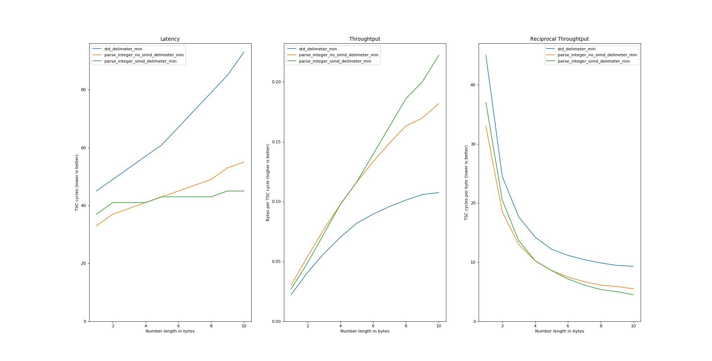
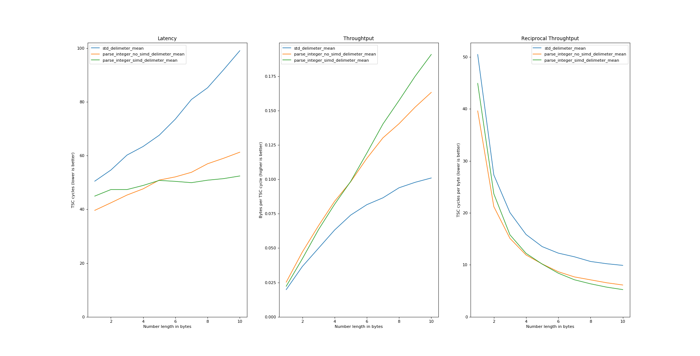
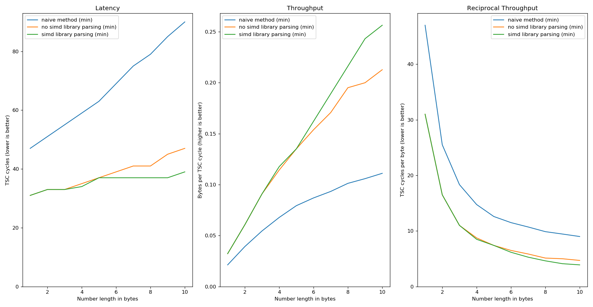

# simd-string-to-integer-parsing

**WARNING! THIS LIBRARY IS A WORK IN PROGRESS**

Optimized integer parsing, enabling SIMD instructions whenever is possible.

## Overview

This library provides a faster implementation to parse an integer from a string. By now, it only supports `u32` parsing. The main method is `parse_integer`, which try to parse a `u32` from the input string; it also handles separators and terminating characters, specified by the user.

Since this library internally uses SIMD intrinsics, they are only supported when the input string has length at least equal to 16. In the other cases, the parsing algorithm falls back to an iterative process.

## Supported architectures

The provided implementations require x86_64 architectures. The code determines at runtime the best implementation to choose according to the underlying CPU. To get the performance benefits of this library, at least SSE4.1 instruction set is required. There are also SSE4.2 and AVX2 implementations available.

## Some benchmarks

The following benchmarks are generated via the `src/bin/bench/main.rs` file, reading the TSC register. Since they heavily depend on the hosting machine, here are the specs of the testing machine:

```console
$ sudo journalctl --boot | grep 'kernel: tsc:' -i | cut -d' ' -f5-
 kernel: tsc: Detected 2700.000 MHz processor
 kernel: tsc: Detected 2699.909 MHz TSC
 kernel: tsc: Refined TSC clocksource calibration: 2711.999 MHz

$ sudo cat /sys/devices/system/cpu/cpu0/cpufreq/cpuinfo_{min,max}_freq
 800000
 3300000

$ screenfetch -n -N
 OS: Fedora 
 Kernel: x86_64 Linux 5.14.13-200.fc34.x86_64
 CPU: Intel Core i5-6400 @ 4x 3.3GHz [26.0°C]
 GPU: NV126
 RAM: 2229MiB / 7866MiB

$ rustc --version
 rustc 1.58.0-nightly (91b931926 2021-10-23)
```

And now some benchmarks:

### SSE4.1

The string to parse has length 15 for both the naive parsing method (i.e. split the string at delimeter and parse the result with the built-in `parse` method) and the `parse_integer` without SIMD; while for the `parse_integer` with SIMD, the string has length 16, with the separator in the same place of the others. 

- minimum performance achived 
- mean performance 

### AVX2

The string to parse has length 31 for both the naive parsing method (i.e. split the string at delimeter and parse the result with the built-in `parse` method) and the `parse_integer` without SIMD; while for the `parse_integer` with SIMD, the string has length 31, with the separator in the same place of the others. 

- minimum performance achived 
- mean performance 


## About code safety

Working with CPU intrinsics is `unsafe`. The code should be robust enough to remove any kind of runtime exception or compile time error. To guarantee safety, all the intrinsic calls are surround by `#[cfg]` and `#[target_feature]` directives to compile and call functions only for supported CPUs. For further information and a better explanation, please refer to the Rust documentation https://doc.rust-lang.org/core/arch/index.html.

## References

This library takes inspiration from different sources; here are some of them:

- [Faster Integer Parsing](https://rust-malaysia.github.io/code/2020/07/11/faster-integer-parsing.html)
- [Crunching Numbers with AVX and AVX2](https://www.codeproject.com/Articles/874396/Crunching-Numbers-with-AVX-and-AVX)
- Mühlbauer, Tobias et al. “Instant Loading for Main Memory Databases.” Proceedings of the VLDB Endowment 6.14 (2013): 1702–1713. Web.
- Langdale, Geoff, and Daniel Lemire. “Parsing Gigabytes of JSON Per Second.” The VLDB journal 28.6 (2019): 941–960. Web.

