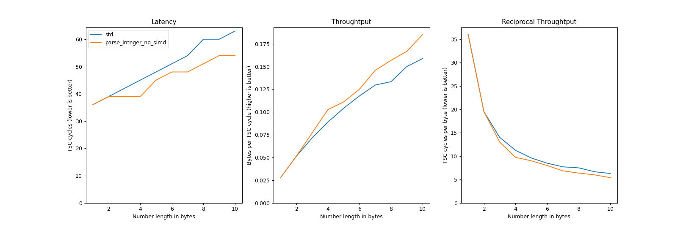
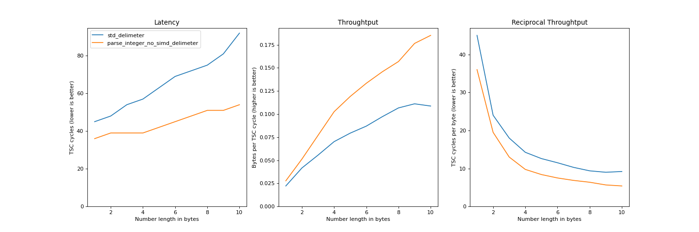
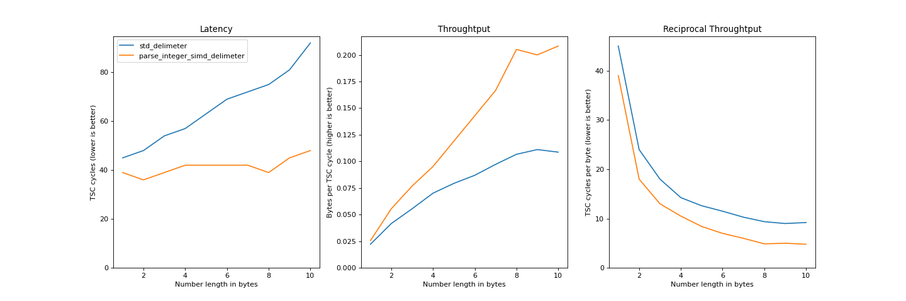

# simd-string-to-integer-parsing

**WARNING! THIS LIBRARY IS A WORK IN PROGRESS**

Optimized integer parsing, enabling SIMD instructions whenever is possible.

## Overview

This library provides a faster implementation to parse an integer from a string. By now, it only supports `u32` parsing. The main method is `parse_integer`, which try to parse a `u32` from the input string; it also handles separators and terminating characters, specified by the user.

Since this library internally uses SIMD intrinsics, they are only supported when the input string has length at least equal to 16. In the other cases, the parsing algorithm falls back to an iterative process.

## Some benchmarks

The following benchmarks are generated via the `src/main.rs` file, reading the TSC register. Since they heavily depend on the hosting machine, here are the specs of the testing machine:

```console
$ sudo journalctl --boot | grep 'kernel: tsc:' -i | cut -d' ' -f5-
 kernel: tsc: Fast TSC calibration using PIT
 kernel: tsc: Detected 2294.683 MHz processor
 kernel: tsc: Refined TSC clocksource calibration: 2294.786 MHz

$ sudo cat /sys/devices/system/cpu/cpu0/cpufreq/cpuinfo_{min,max}_freq
 800000
 2900000

$ screenfetch -n -N
 OS: Manjaro 21.1.5 Pahvo
 Kernel: x86_64 Linux 5.10.70-1-MANJARO
 CPU: Intel Core i5-2415M @ 4x 2.9GHz [60.0°C]
 GPU: Mesa DRI Intel(R) HD Graphics 3000 (SNB GT2)
 RAM: 1787MiB / 3841MiB
```

Here are the benchmarks:

- built-in `parse` vs. `parse_integer` without SIMD and without separator: 
- built-in `parse` vs. `parse_integer` without SIMD but with separator: 
- built-in `parse` vs. `parse_integer` SIMD and separator: 

## References

This library takes inspiration from different sources; here are some of them:

- [Faster Integer Parsing](https://rust-malaysia.github.io/code/2020/07/11/faster-integer-parsing.html)
- [Crunching Numbers with AVX and AVX2](https://www.codeproject.com/Articles/874396/Crunching-Numbers-with-AVX-and-AVX)
- Mühlbauer, Tobias et al. “Instant Loading for Main Memory Databases.” Proceedings of the VLDB Endowment 6.14 (2013): 1702–1713. Web.
- Langdale, Geoff, and Daniel Lemire. “Parsing Gigabytes of JSON Per Second.” The VLDB journal 28.6 (2019): 941–960. Web.

