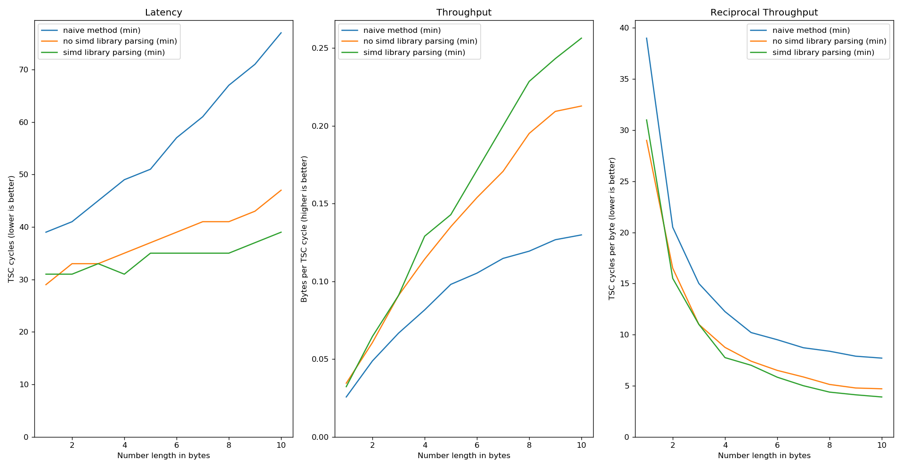
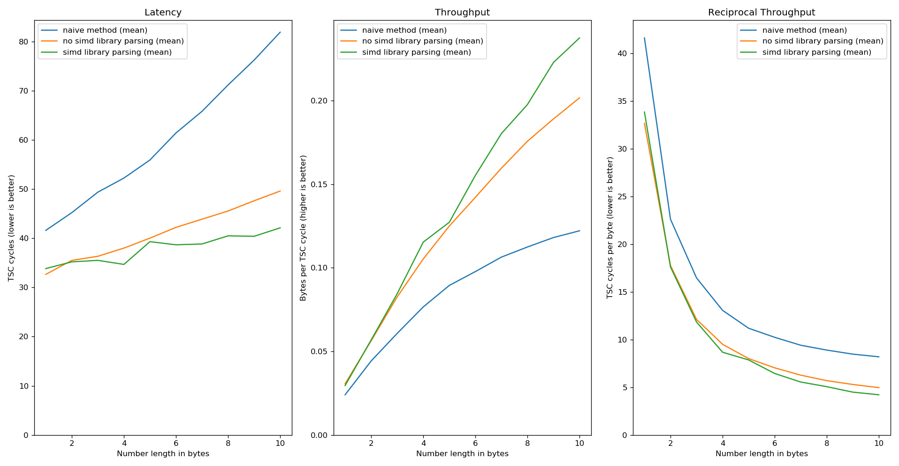
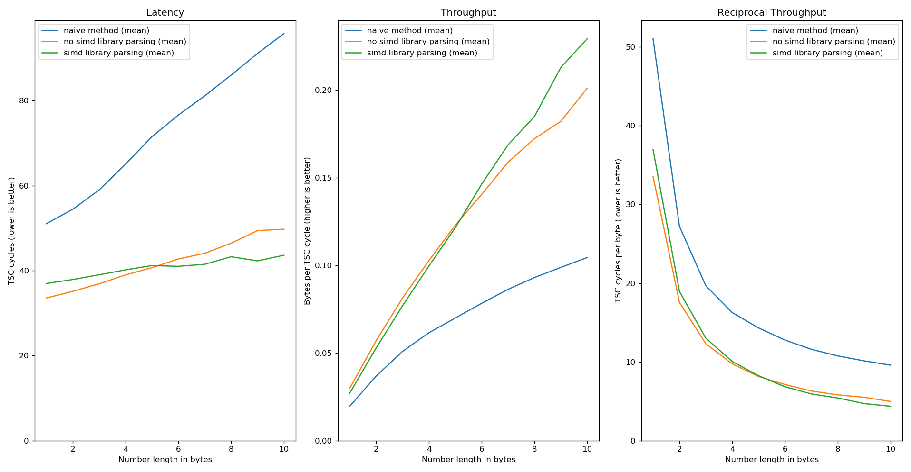

# simd-string-to-integer-parsing

Optimized integer parsing, enabling SIMD instructions whenever is possible.

## Overview

This library provides a faster implementation to parse an integer from a string.
By now, it only supports `u32` parsing.  There are two main methods:
`parse_integer` parses an `u32` from the input string as far as there are digits
in the string; the other method is `parse_integer_separator`, which parses an
`u32` from the input string up to the the first occurence of a user specified
separator.  There are also their unchecked counterparts, called
`parse_integer_unchecked` and `parse_integer_separator_unchecked`, which are way
faster than the previous versions, but they will be panic if the input string
generates overflow errors.

Note that both `parse_integer` and `parse_integer_separator` will use SIMD
acceleration if the input string is conform to following requirements:

    - input string as length at least 16 for SSE4.1\2 or 32 for AVX2;
    - the number to parse is composed of between 1 to 9 digits.
    
For the unchecked versions, instead, the number to parse must have a number of
digits between 1 and 10; in the other cases, a panic will be thrown.

If the input string doesn't have a sufficient length, then the parsing algorithm
will use an iterative process, both for checked and unchecked versions.


## Supported architectures

The provided implementations require x86_64 architectures. The code determines
at runtime the best implementation to choose according to the underlying CPU. To
get the performance benefits of this library, at least SSE4.1 instruction set is
required. There are also SSE4.2 and AVX2 implementations available.

## Some benchmarks

The following benchmarks are generated via the `src/bin/bench/main.rs` file,
reading the TSC register. Since they heavily depend on the hosting machine, here
are the specs of the testing machine:

```console
$ sudo journalctl --boot | grep 'kernel: tsc:' -i | cut -d' ' -f5-
 kernel: tsc: Detected 2700.000 MHz processor
 kernel: tsc: Detected 2699.909 MHz TSC
 kernel: tsc: Refined TSC clocksource calibration: 2711.999 MHz

$ sudo cat /sys/devices/system/cpu/cpu0/cpufreq/cpuinfo_{min,max}_freq
 800000
 3300000

$ screenfetch -n -N
 OS: Fedora 
 Kernel: x86_64 Linux 5.14.13-200.fc34.x86_64
 CPU: Intel Core i5-6400 @ 4x 3.3GHz [26.0°C]
 GPU: NV126
 RAM: 2229MiB / 7866MiB

$ rustc --version
 rustc 1.58.0-nightly (91b931926 2021-10-23)
```

And now some benchmarks:

### SSE4.1

The string to parse has length 15 for both the naive parsing method (i.e. split
the string at delimeter and parse the result with the built-in `parse` method)
and the `parse_integer` without SIMD; while for the `parse_integer` with SIMD,
the string has length 16, with the separator in the same place of the others. 

- minimum performance achived 
- mean performance 

### AVX2

The string to parse has length 31 for both the naive parsing method (i.e. split
the string at delimeter and parse the result with the built-in `parse` method)
and the `parse_integer` without SIMD; while for the `parse_integer` with SIMD,
the string has length 31, with the separator in the same place of the others. 

- minimum performance achived 
- mean performance 


## About code safety

Working with CPU intrinsics is `unsafe`. The code should be robust enough to
remove any kind of runtime exception or compile time error. To guarantee safety,
all the intrinsic calls are surrounded by `#[cfg]` and `#[target_feature]`
directives to compile and call functions only for supported CPUs. For further
information and a better explanation, please refer to the Rust documentation
https://doc.rust-lang.org/core/arch/index.html.

## References

This library takes inspiration from different sources; here are some of them:

- [Faster Integer Parsing](https://rust-malaysia.github.io/code/2020/07/11/faster-integer-parsing.html)
- [Crunching Numbers with AVX and AVX2](https://www.codeproject.com/Articles/874396/Crunching-Numbers-with-AVX-and-AVX)
- Mühlbauer, Tobias et al. “Instant Loading for Main Memory Databases.” Proceedings of the VLDB Endowment 6.14 (2013): 1702–1713. Web.
- Langdale, Geoff, and Daniel Lemire. “Parsing Gigabytes of JSON Per Second.” The VLDB journal 28.6 (2019): 941–960. Web.

